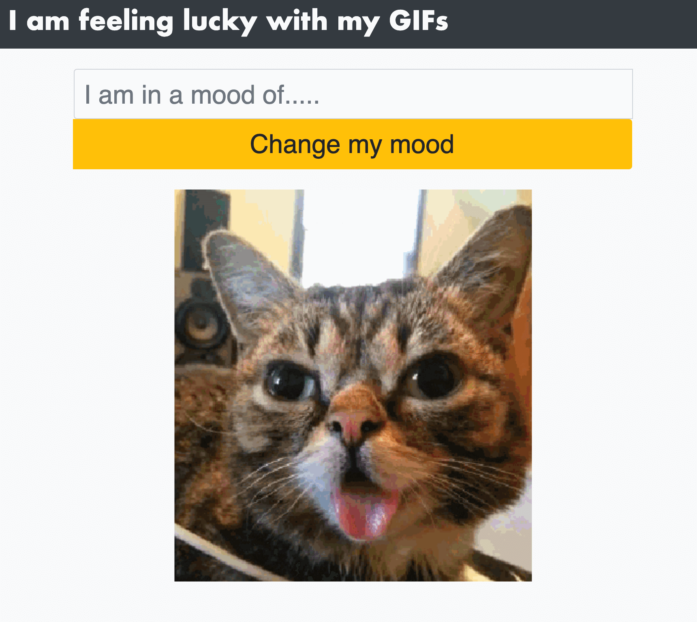

# Gif My Mood: API practice project

Basic form to consume a "on demand" giphy GIF (API) based on input text

# Live demo

[live demo](https://rawcdn.githack.com/canriquez/JSON_practice/bf933f0f945db89e78a6adb050eef7f75ee0ca5d/dist/index.html)



# Project Details
 
- The projects builds a simple page with a single "text" input.
- fetches a new image based on the key search text 
- renders the image in the page without refreshing the page.

## Built With

- HTML/CSS, Javascript, Webpack, NPM, yarn.
- ESlint, Stylelint
- VSCode
- [Giphy API](https://giphy.com/)


## Getting Started


To get a local copy up and running, follow these simple example steps.

### Prerequisites
- To install the app in your system, make sure you have node/npm installed. [get npm](https://www.npmjs.com/get-npm)

### Setup
- Clone the repository in your system by using: 

``` git clone  ```

### Install
- Next step is to CD into the local repository and run:

``` $ npm install ```


## Author

👤 ***Carlos Anriquez***

- Github: [@canriquez](https://github.com/canriquez)
- Twitter: [@cranriquez](https://twitter.com/cranriquez)
- Linkedin: [linkedin](https://www.linkedin.com/in/carlosanriquez/)
- Portfolio: [carlosanriquez.com](https://www.carlosanriquez.com)

## 🤝 Contributing

Contributions, issues, and feature requests are welcome!

Feel free to check the [issues page](issues/).

## Show your support

Give a ⭐️ if you like this project!

## Acknowledgments

- Family, always my family.
- The Beagles!

## 📝 License

This project is [MIT](./LICENSE) licensed.
